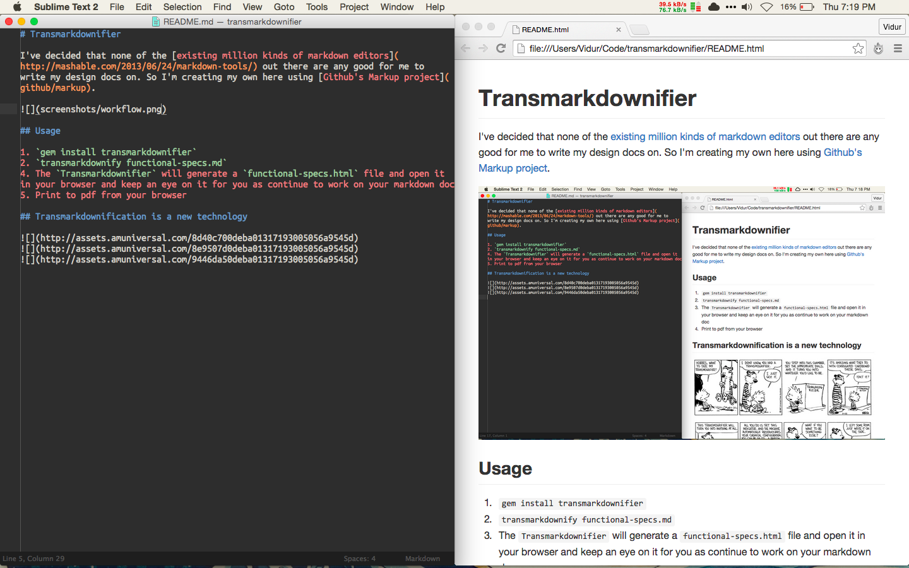

# Transmarkdownifier

I've decided that none of the [existing million kinds of markdown editors](http://mashable.com/2013/06/24/markdown-tools/) out there are any good for me to write my design docs on. So I'm creating my own here using [Github's Markup project](github/markup).

## Usage

1. `gem install transmarkdownifier`
2. `transmarkdownify functional-specs.md`
4. The `Transmarkdownifier` will generate a `functional-specs.html` file and open it in your browser and keep an eye on it for you as continue to work on your markdown doc
5. Print to pdf from your browser

## Transmarkdownification is a new technology

